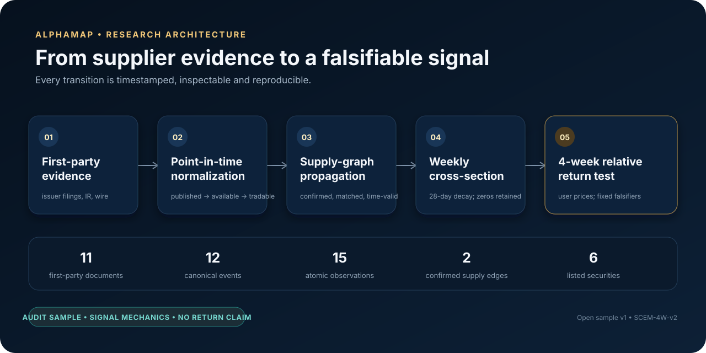
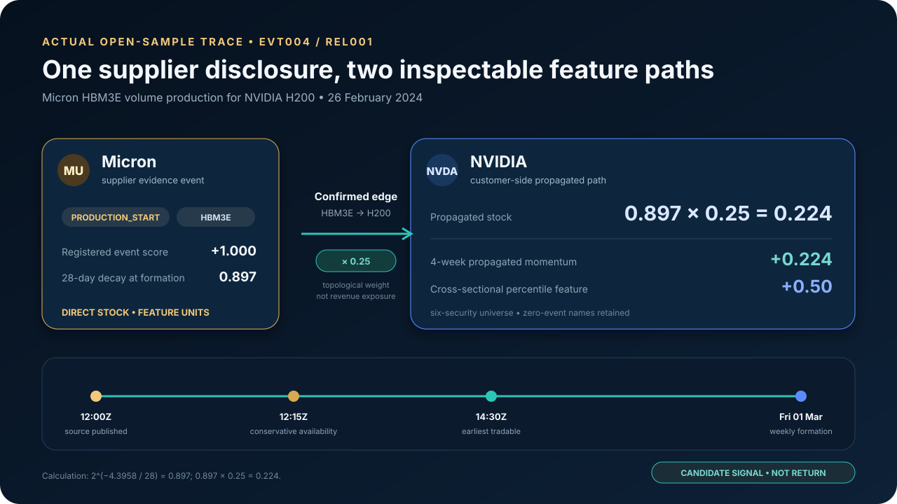
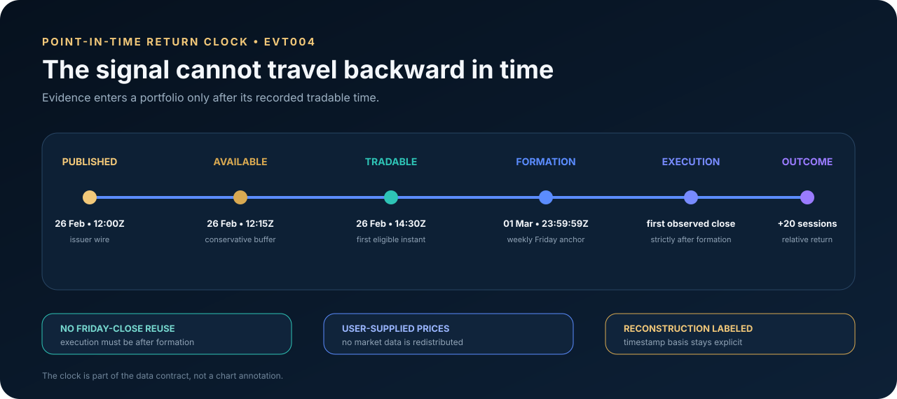
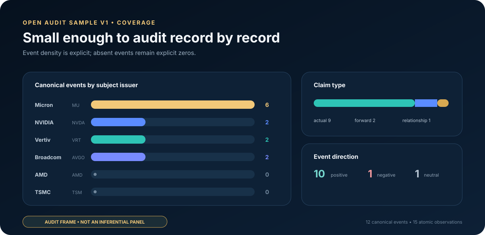

<p align="center">
  
</p>

<h1 align="center">AlphaMap Open Benchmark</h1>

<p align="center">
  <strong>Point-in-time AI-infrastructure evidence for reproducible public-equity research.</strong><br>
  An open audit sample for testing whether supply-chain evidence momentum predicts the next four weeks of relative returns.
</p>

<p align="center">
  <a href="https://github.com/Lunartulip/AlphaMap-Open-Benchmark/actions/workflows/ci.yml"></a>
  <a href="datapackage.json"></a>
  <a href="research/protocol.json"></a>
</p>



## Registered question

> **Does supply-chain evidence momentum predict AI-infrastructure companies' next four-week relative returns?**

AlphaMap makes the proposed path to alpha inspectable: earlier supplier evidence, point-in-time availability, product-aware graph propagation and a fixed forward-return clock. The open sample demonstrates the data and signal mechanics. Statistical claims require the frozen production sampling frame and prospective holdout defined in **SCEM-4W-v2**.

## Where a candidate signal can come from

- **Lead-lag evidence:** supplier production and capacity disclosures may arrive before customer fundamentals fully reflect the same infrastructure cycle.
- **Graph-aware attribution:** evidence propagates only through confirmed, product-matched and time-valid supply relationships.
- **Tradable implementation:** weekly features retain the complete universe, enforce conservative availability and execute only after formation.



This trace is calculated from shipped records `EVT004` and `REL001`. At the 2024-03-01 formation, EVT004's 28-day decayed direct contribution is **0.897**; the registered 0.25 propagation coefficient produces NVIDIA propagated momentum of **+0.224** and a six-security cross-sectional feature of **+0.50**. These are feature units, not realized returns. The coefficient is a topological research parameter, not an estimate of economic exposure.

## Point-in-time by construction



Historical records reconstructed after publication carry `timestamp_basis=reconstructed_conservative`. They demonstrate no-lookahead mechanics but are never represented as contemporaneously captured observations. Required market prices are supplied by the researcher and are not redistributed in this repository.

## Open audit sample v1



| Property | Coverage |
| --- | --- |
| Evidence window | 2023-08-23 to 2025-03-18 |
| Listed issuers | 6 |
| Canonical events | 12 |
| Atomic observations | 15 |
| First-party documents | 11 |
| Confirmed supply edges | 2 |
| Timestamp basis | Explicitly observed or conservatively reconstructed |
| Inference eligibility | No; data engineering and source audit only |

The sample is intentionally small enough to reconstruct record by record. `coverage.csv` identifies its selection role and prevents accidental use as an inferential backtest.

## What is measured

A source event produces a direct issuer evidence impulse. When an active confirmed supplier edge exists, the same event can produce a separately labeled one-hop propagated impulse for the customer security. The registered supply-chain momentum feature is the change in 28-day decayed propagated evidence stock over four weeks.

Direct and propagated components remain independently inspectable. Relationship knowledge time, event type, product applicability and parallel-edge deduplication are enforced before propagation.

## Quick start

```bash
python -m pip install -e ".[dev]"
frictionless validate datapackage.json
alphamap-validate data/sample/v1 --manifest
pytest
python research/run_research.py --prices examples/price_input_schema.csv
```

Required price columns are `date`, `security_id` and `adjusted_close`.

## Repository map

- `data/sample/v1`: normalized audit sample and release manifest
- `datapackage.json`: Frictionless tabular data package
- `src/alphamap_open`: contract validation, signal construction and evaluation
- `research`: pre-registration state and reproducible runner
- `docs`: methodology, sampling, timestamps, governance and field semantics
- [Release roadmap](docs/ROADMAP.md): first 48 hours through vendor-readiness gates
- `CHANGELOG.md`: release history and link to the historical visualization commit

## Quality principles

1. Event dates never substitute for availability or execution timestamps.
2. Issuer-reported actuals and forward statements remain distinct.
3. No-event securities remain in the weekly cross-section with a zero score.
4. Revisions are append-only after release.
5. Data contracts are executable and release files are content-addressed.
6. Baselines, costs, lags, concentration tests and falsifiers are fixed before results.
7. A negative result is a valid registered outcome.

Code is MIT licensed. AlphaMap-authored normalized data is CC BY 4.0 subject to `DATA-LICENSE.md`.